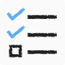
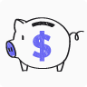
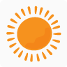
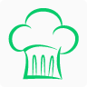

# Personal Assistant

An ecosystem of PWAs that cooperate with each other to provide unique functionalities.

[https://personalassistant.site](https://personalassistant.site)

## Apps

### To Do Assistant

- Create lists and tasks
  - Delete tasks upon completion
  - Flag tasks as high priority
  - Search tasks within list
  - Get hints for duplicate and similar tasks
- Share lists with other users
  - Get notifications in shared lists
  - Set permissions of shared list members
  - Create private tasks in shared lists
- Reorder lists and tasks
- Copy lists
- Archive unused lists
- Easily create multiple tasks from text

### Accountant

- Create expense categories
- Make deposits and withdrawals
- Track your spending
- Track and anticipate upcoming expenses
  - Get automatically generated upcoming expenses every month based on your spending in a given category
- Manage multiple accounts
- Manage investment funds
- Track debt
- Setup transactions to be automatically created for you every month
- View different types of reports regarding your income and expenditures
- Get an early retirement calculation based on your personal financial situation
- Encrypt your transactions for privacy
- Offline mode
- Supports 168 currencies

### Cooking Assistant (back in development)

- Create recipes
- Share recipes with other users
  - Get notifications in shared recipes
- Send recipes to other users
- Link ingredients to tasks in To Do Assistant and see whether you have the required ingredients to prepare a meal
- See the nutrition and cost of recipes
- Create a dietary profile and track your daily nutrient intake

### Weatherman

- Be aware of the weather

## Development

You will need an `.env` file if you want to start it locally with Docker. Just create a copy of `.env.example` and update the variables with the appropriate values.

## License

This project is licensed under the GNU GPLv3 License - see the [LICENSE](LICENSE) file for details.
